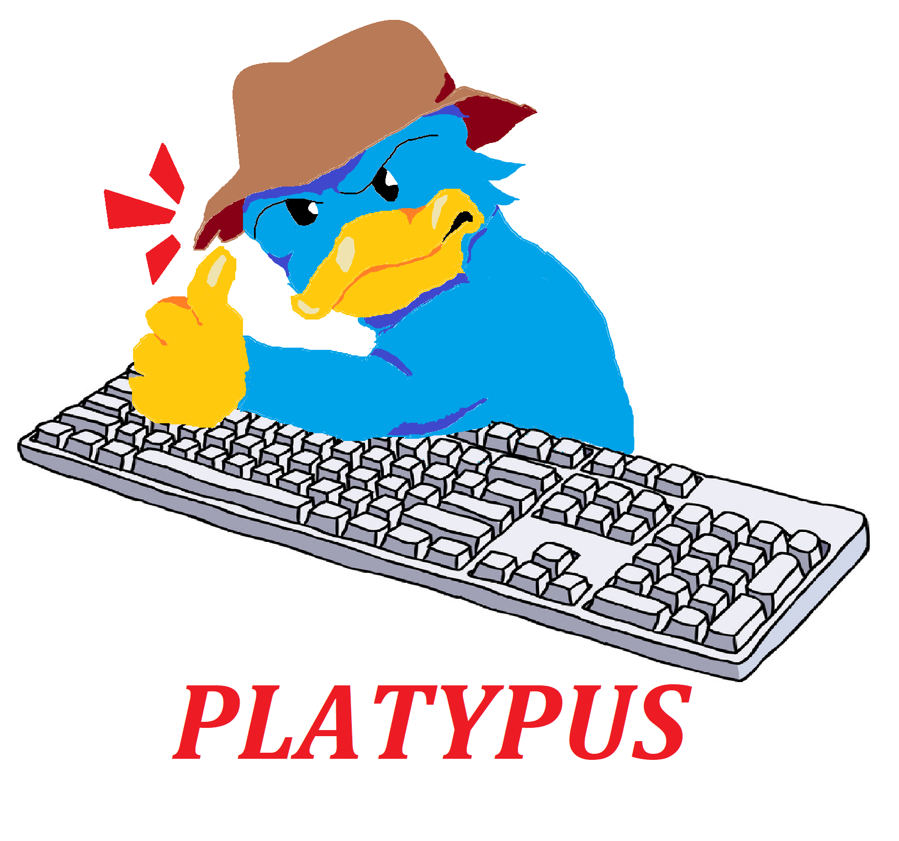

## platypus
platypus is a language designed to combine a safety-first ownership model and a developer friendly syntax. The intention is to enforce memory-safe practices at compilation, significantly reducing the runtime’s memory management overhead. Rust, the largest competitor in this domain, is a low-level systems language that can be difficult to understand for a user who is used to higher-level languages such as Python and JavaScript. Our goal is to act as an intermediary between these two parties.

### install required packages
1. ```make install```

### running the ast builder and pretty-printer
1. ```make```
2. ```./platypus -a ./path/to/file.ppus```

### running the tests
1. ```make test```

### contact information
Dylan Maloy (dylan.maloy@tufts.edu)
Rodrigo Campos (rodrigo.campos@tufts.edu)
Ronit Sinha (ronit.sinha@tufts.edu)
Tony Huang (ziheng.huang@tufts.edu)
Abe Park (yangsun.park@tufts.edu)